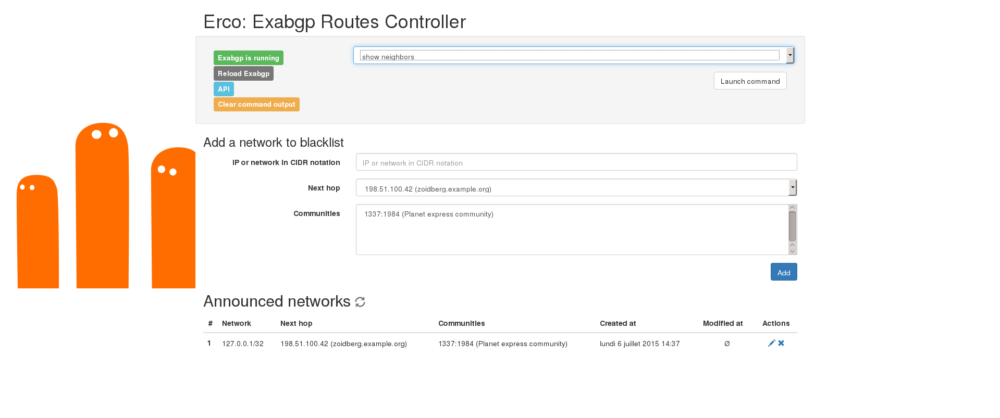

# Erco: Exabgp Routes Controller

## What is Erco?

Erco is a tool which facilitates the configuration of announced routes (with or without BGP communities) with the [Exabgp](https://github.com/Exa-Networks/exabgp) software.

It provides an [RESTful API](https://en.wikipedia.org/wiki/Representational_state_transfer) and a web interface.

## Demo

No more talking? You want action? All right, all right: <http://erco.xyz/demo/>.

## How does it work?

Erco will rewrite a part of Exabgp's configuration file and reload it.

At startup, Erco read Exabgp's configuration file to get the announced routes: no database required.

## How to use it?

You can use it:

* trough the API, perfect for machines or scripting
* from the web interface, perfect for humans

## Documentation

The documentation is located at <http://erco.xyz/doc/index.html>, but you can [download the sources](https://git.framasoft.org/luc/erco-site/tree/master/content/doc) of the documentation.

For the API, the documentation is located in the `public/api/index.html` file, which you can read online at <http://erco.xyz/demo/api/index.html>.

## Use case

Erco has been initially developped at the [Lorraine University](http://univ-lorraine.fr) for interacting with a [Real-Time Black Hole](https://en.wikipedia.org/wiki/Black_hole_(networking)) service between a user network and an [ISP](https://en.wikipedia.org/wiki/Internet_service_provider) network.

Erco can be used for any other usage requiring BGP route annoucement.
